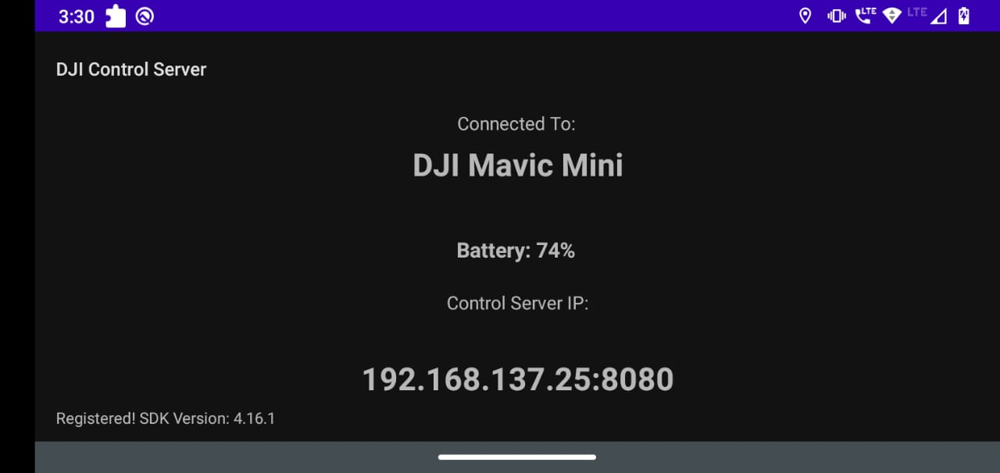

# DJI Control Server

Android App that exposes a high level REST API to control DJI drones and fetch certain state variables. Primarily created to control DJI drones using code in a GPS denied indoor environment.

## Features

1. Take off and land drone.
2. 6DOF motion control. Move up, down, forward, backwards, left, right, as well as rotate clockwise and counter clockwise.
3. Control in both Position mode and Velocity mode.
3. Start and stop collecting X, Y, Z velocities at given frequency and fetch recorded states.
4. Enable/Disable Landing Protection.
5. Get/Set top speed.
6. Get/Set velocity profile. Can choose from constant, trapezoidal or S-curve.

## End Points

Following are the available endpoints, all as GET Requests:

**Connection**
* `/`: Connection test endpoint. Returns string "Connected" if request received successfully.

**Takeoff and Landing**

* `/takeoff`: Initiate take off. Returns when takeoff is successfully initiated.
* `/land`: Initiate landing. If landing protection is enabled, it descends to 30cm off the ground and awaits landing confirmation. If landing protection is disabled causes the drone to land. Returns when landing is successfully initiated.
* `/confirmLanding`: Needed to confirm landing only if landing protection is enabled. Returns when landing confirmation is successfully initiated.
* `/isLandingProtectionEnabled`: Returns true if landing protection is enabled, else false.
* `/enableLandingProtection`: Enables landing protection.
* `/disableLandingProtection`: Disables landing protection.

**Control Modes**

* `/getControlMode`: Returns the current control mode. Either POSITION or VELOCITY. Defaults to `POSITION` on app launch.
* `/setControlMode/{mode}`: Sets the current control mode. `mode` must be `"POSITION"` or `"VELOCITY"`

**Motion Planning**

* `/getMaxSpeed`: Gets max allowable speed in m/s.
* `/setMaxSpeed/{speed}`: Sets max allowable speed, with parameter `speed` in m/s
* `/getMaxAngularSpeed`: Get max allowable angular speed in deg/s
* `/setMaxAngularSpeed/{speed}`: Set max allowable speed, with parameter `speed` in deg/s
* `/getVelocityProfile`: Gets the current velocity profile used to generate velocity commands for movement. Defaults to `CONSTANT` on app launch.
* `/setVelocityProfile/{profile}`: Sets the velocity profile to be used. Parameter `profile` must be `"CONSTANT"`, `"TRAPEZOIDAL"` or `"S_CURVE"`.

**IMU state reading**

* `/startCollectingIMUState/{interval}`: Starts a coroutine that collects the current IMU state (X velocity, Y velocity, Z velocity, Roll, Pitch, Yaw) every `interval` milliseconds.
* `/stopCollectingIMUState`: Stops the coroutine registered by calling `startCollectingIMUState`
* `/getCollectedIMUStates`: Returns a list of IMU states collected so far.
* `/clearCollectedIMUStates`: Clears the collected IMU states list.
* `/getCurrentIMUState`: Gets current IMU state (X velocity, Y velocity, Z velocity, Roll, Pitch, Yaw). Not recommended, since there is a transmission delay between the client to the server, which would mean the IMU State returned is of a different from both request and response times.

**Positional Movement and Rotation**

Following endpoints only available when control mode is set to `POSITION`

* `/moveForward/{dist}`: Move forward `dist` meters. Returns when the planned flight paths is entirely traversed.
* `/moveBackward/{dist}`: Move backward `dist` meters. Returns when the planned flight paths is entirely traversed.
* `/moveLeft/{dist}`: Move left `dist` meters. Returns when the planned flight paths is entirely traversed.
* `/moveRight/{dist}`: Move right `dist` meters. Returns when the planned flight paths is entirely traversed.
* `/moveUp/{dist}`: Move up `dist` meters. Returns when the planned flight paths is entirely traversed.
* `/moveDown/{dist}`: Move down `dist` meters (*Unsafe method since there is no check on current altitude before calling this*). Returns when the planned flight paths is entirely traversed.
* `/rotateClockwise/{angle}`: Rotate clockwise by given angle (in degrees). Returns when the planned flight paths is entirely traversed.
* `/rotateCounterClockwise/{angle}`: Rotate counter clockwise by given angle (in degrees). Returns when the planned flight paths is entirely traversed.

**Velocity Control Commands**

Following endpoints only availabe when control mode is set to `VELOCITY`

* `/startVelocityControl`: Starts coroutine that moves drone with currently set velocity vector.

* `/setVelocityCommand/{xVel}/{yVel}/{zVel}/{yawRate}`: Sets the velocity vector given the parameters. Can only be called after calling `/startVelocityControl`.

* `/getCurrentVelocityCommand`: Fetches the current Velocity Command (X Velocity, Y Velocity, Z Velocity, Yaw Rate)

* `/stopVelocityControl`: Stops coroutine that moves drone with currently set velocity vector.

**Other**

* `/getHeading`: Returns current heading angle with respect to true north.

## Usage

To build this app, clone the repo and open it in Android Studio. Then, in the Android Manifest file, on `Line 31`, replace `YOUR-API-KEY-HERE` with an API key generated by you on the DJI developer portal. Ensure that the package name for the app is set to `com.rrc.djiControlServer` when creating the API Key. Build the app and install it on an android mobile device.

Start the app, and connect the phone to a DJI remote controller. Once the drone is connected to the remote controller, all the API endpoints should become available on the IP address of the mobile device on port `8080`.

Works well with the `DJIControlClient` written in Python, but in practice can work with any langauge where REST API calls can be made.

## Caveats

1. The `confirmLanding` endpoint works as expected in the DJI simulator, causing the drone the land after stopping at 30cm off the ground, waiting for confirmation. However, this behavior is not seen with a physical drone. Need to experiment more to figure out why this is the case.
2. All the motion commands are implemented using open loop solutions. This leaves a lot of room for error in the motion. It is found that while the S-Curve and Trapezoidal velocity profiles provide much smoother motion, the distance covered has significant error with respect to the provided distance, as compared to using the Constant velocity profile.
3. Since this app is primarily for controlling the drone in an indoor, GPS denied environment, no GPS based functionality has been implemented.
4. I have no Android development experience. All of my Kotlin implementation has come from searching through their docs and StackOverflow. As such, the `MainActivity` is one monolithic mess (I've tried to keep it as organized as possible). Just a disclaimer for any advanced android developers before delving into the code.